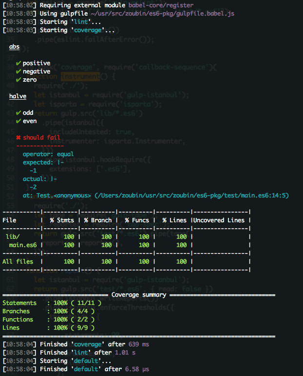

# es6-pkg
Boilerplate for developing node modules using es6

## Usage

```bash
npm i -g es6-pkg

cd /path/to/your/project

# maybe
npm init

es6pkg

```

Make sure you are in the package root directory,
where a `package.json` must exist.

Make sure no `index.js` exist in the root directory.
The entry file is `lib/main.es6` by default.

Your project directories should look like this:

```
⌘ tree -L 2
.
├── LICENSE
├── README.md
├── bin
├── build
│   ├── LICENSE
│   ├── README.md
│   ├── lib
│   └── package.json
├── coverage
│   ├── coverage-final.json
│   ├── lcov-report
│   └── lcov.info
├── gulpfile.babel.js
├── index.js
├── lib
│   └── main.es6
├── node_modules
│   ├── babel-core
│   ├── callback-sequence
│   ├── del
│   ├── gulp
│   ├── gulp-babel
│   ├── gulp-eslint
│   ├── gulp-istanbul
│   ├── gulp-json-editor
│   ├── gulp-tape
│   ├── gulp-util
│   ├── isparta
│   ├── require-uncached
│   ├── run-sequence
│   ├── tap
│   ├── tap-spec
│   ├── tape
│   └── through2
├── package.json
└── test
    └── main.es6
```

Run `npm test` or `gulp` to see if everything works properly.
You should see output like:



## Test

Refer to [tape](https://github.com/substack/tape) to learn how to write tests.

The default reporter is [tap-spec](https://github.com/scottcorgan/tap-spec).

Coverage statistics is done by
[istanbul](https://github.com/SBoudrias/gulp-istanbul) and
[isparta](https://github.com/douglasduteil/isparta).

## Lint

Refer to [eslint](https://github.com/eslint/eslint/tree/master/docs/rules)
to learn how to confiure.

## Learn es6

* [lukehoban#es6features](https://github.com/lukehoban/es6features)
* [ecma-262 6th edition](http://www.ecma-international.org/ecma-262/6.0/)
* [mdn](https://developer.mozilla.org/en-US/docs/Web/JavaScript)

